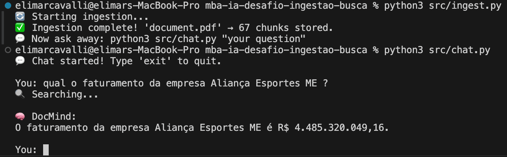
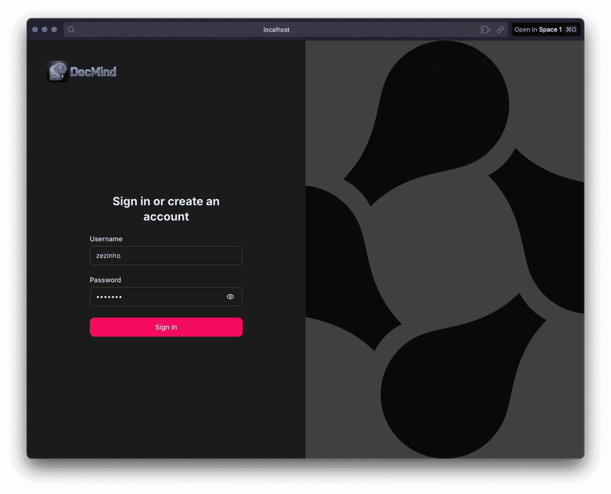
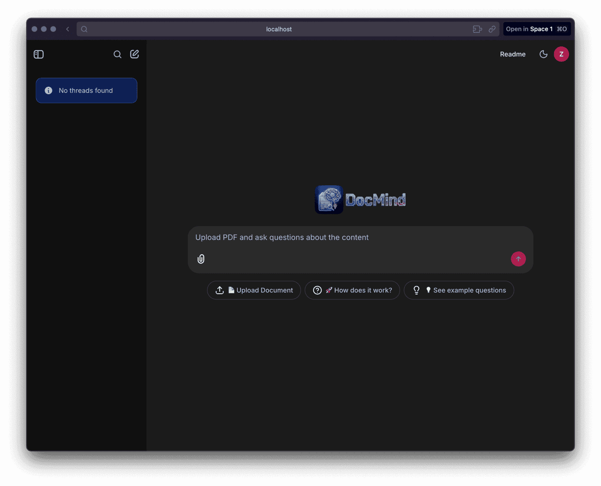
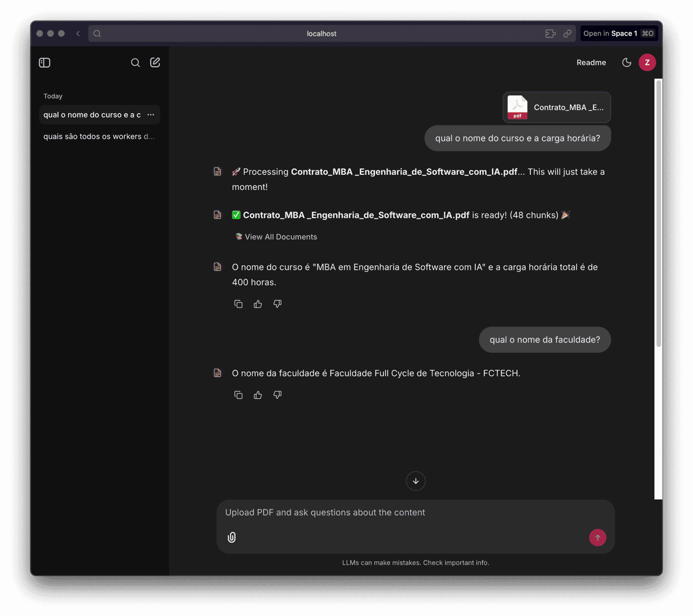
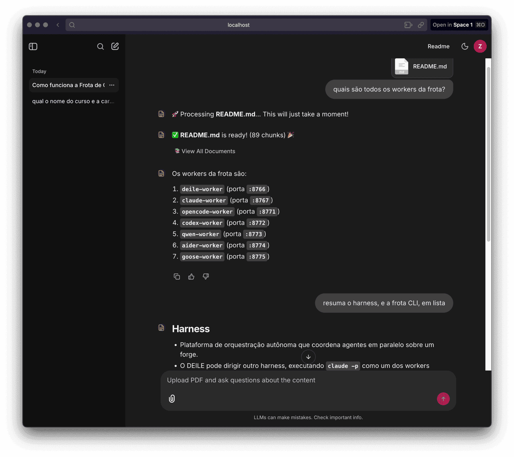
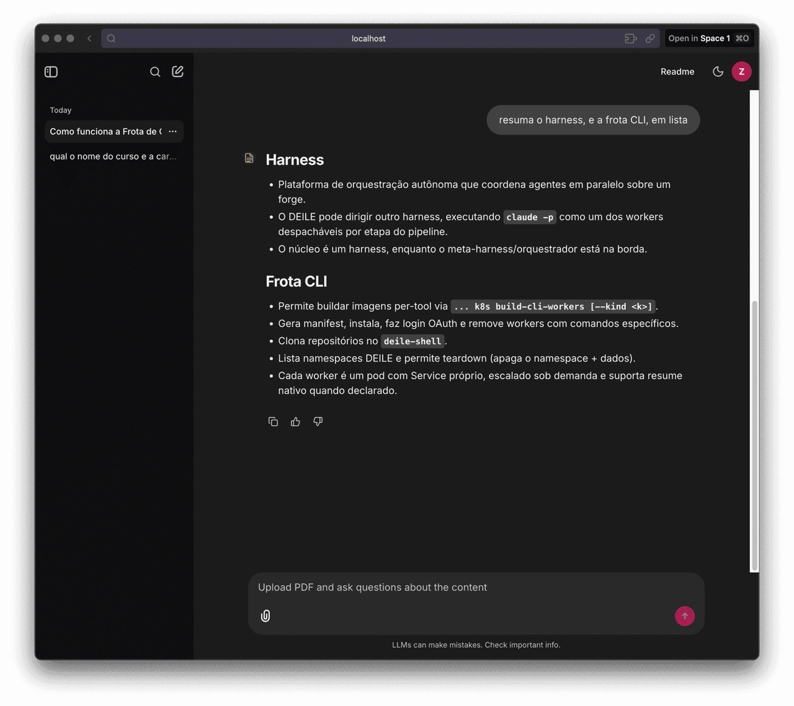
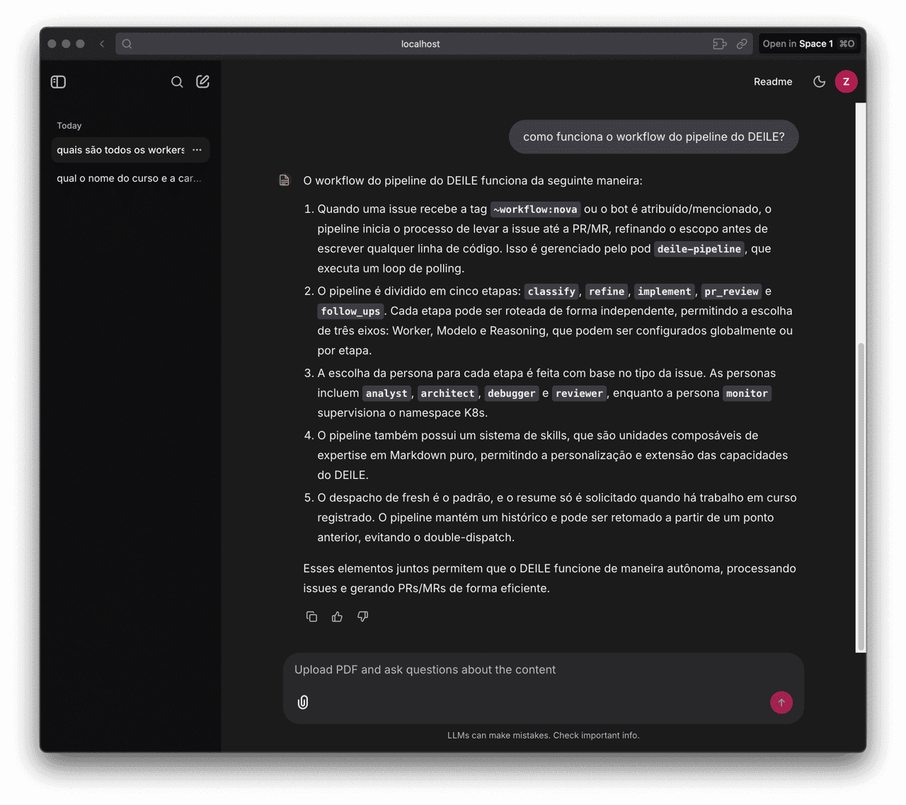
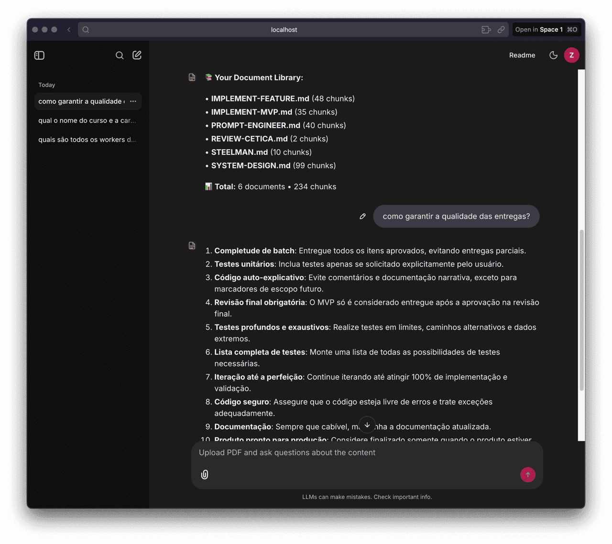

# 📄🧠 DocMind - Sistema RAG de Busca Semântica

> **Seu assistente inteligente para documentos** — PDF, TXT, CSV, HTML, JSON, Markdown e DOCX. Faça perguntas e obtenha respostas precisas baseadas nos seus documentos!


---

## 💡 O que é o DocMind?

**DocMind transforma qualquer documento em um assistente inteligente que responde suas perguntas instantaneamente.** Acabou a busca manual por informações em documentos extensos!

Imagine ter um especialista que leu todo o seu documento e pode responder qualquer pergunta sobre ele em segundos - isso é o DocMind.

### 🆚 Por que RAG é superior?

| Abordagem                   | Limitações                                        | DocMind (RAG)                               |
| --------------------------- | ------------------------------------------------- | ------------------------------------------- |
| **Busca por palavra-chave** | Encontra apenas termos exatos, ignora contexto    | ✅ Entende sinônimos e contexto semântico   |
| **ChatGPT direto**          | Inventa informações, não tem acesso aos seus docs | ✅ Respostas baseadas 100% no seu documento |
| **Leitura manual**          | Lento, cansativo, propenso a erros                | ✅ Instantâneo, preciso, nunca esquece      |
| **Ctrl+F tradicional**      | Literal, não compreende perguntas complexas       | ✅ Responde perguntas em linguagem natural  |

### 🔄 Como funciona:

1. 📄 Você faz upload de um documento (PDF, TXT, CSV, HTML, JSON, MD ou DOCX)
2. 🧠 O sistema processa e "entende" o conteúdo usando embeddings vetoriais
3. 💬 Você faz perguntas em linguagem natural
4. 🔍 O sistema busca os trechos mais relevantes semanticamente
5. ✨ A IA gera uma resposta precisa baseada apenas no documento

---

## 🎯 Para que serve?

**Casos de uso práticos:**

- 📚 **Estudantes**: Faça perguntas sobre apostilas, livros e artigos científicos
- 💼 **Profissionais**: Consulte contratos, relatórios e documentação técnica rapidamente
- 🔬 **Pesquisadores**: Extraia informações de papers e documentos acadêmicos
- 📋 **Empresas**: Analise manuais, políticas e documentos corporativos
- 🎓 **Professores**: Prepare materiais e tire dúvidas sobre conteúdos extensos

**Exemplos de perguntas:**

- "Qual é o tema principal deste documento?"
- "O que o texto diz sobre [assunto específico]?"
- "Faça um resumo dos pontos principais"
- "Quais são as conclusões apresentadas?"

---

## 🚀 Como Iniciar

**Requisitos:** [Python 3.12+](https://www.python.org/downloads/) e [Docker Desktop](https://www.docker.com/products/docker-desktop/) instalados

É super simples! Apenas 3 passos:

```bash
# 1. Clone o repositório
git clone https://github.com/elimarcavalli/mba-ia-desafio-ingestao-busca.git

# 2. Entre na pasta
cd mba-ia-desafio-ingestao-busca

# 3. Execute o sistema
python3 main.py
```

### 📺 O que você verá ao iniciar

Quando executar `python3 main.py`, aparecerá um menu interativo:

<pre>
<span style="color: #d946ef; font-weight: bold;">=== MBA Software Engineering with AI - Project Manager ===
GitHub: https://github.com/elimarcavalli/mba-ia-desafio-ingestao-busca.git</span>
1. Start System (Normal)
2. Force Restart (Kill existing + Start)
3. Quick Launch (Skip checks)
4. Stop All Processes (Kill Only)
5. Reset System (Wipe User Data & Config Only)
6. Exit

Select option (1-6):
</pre>

**Para primeira execução, escolha a opção `1`**

> **Login:** na primeira vez que abrir a interface web, basta digitar um novo usuário e senha — sua conta é criada automaticamente (senha protegida com Argon2id, histórico de chat por usuário). Usuários existentes entram pelo mesmo formulário.

O sistema irá:

- ✅ Criar ambiente virtual Python automaticamente
- ✅ Instalar todas as dependências necessárias
- ✅ Configurar o banco de dados PostgreSQL via Docker
- ✅ Pedir sua chave de API (OpenAI ou Google Gemini)
- ✅ Iniciar a interface web em `http://localhost:8000`

**Pronto!** Em menos de 2 minutos você estará conversando com seus documentos! 🎉

---

## 🖥️ Modo CLI

Prefere o terminal? Também funciona sem a interface web:

```bash
# Ingere o documento definido em PDF_PATH no .env (padrão: document.pdf)
python3 src/ingest.py

# Ingere um arquivo específico (substitui o que foi ingerido antes)
python3 src/ingest.py caminho/do/arquivo.pdf

# Adiciona um arquivo mantendo os anteriores (pergunte sobre todos juntos)
python3 src/ingest.py caminho/de/outro.pdf --append

# Faz uma única pergunta e sai (one-shot)
python3 src/chat.py "Qual o faturamento da empresa X?"

# Ou inicia um chat interativo
python3 src/chat.py
```

> 💡 Os scripts usam o `venv` do projeto automaticamente. Ainda não tem um? Rode `python3 main.py` uma vez (opção 1), ou configure manualmente:

```bash
python3 -m venv venv
./venv/bin/pip install -r requirements.txt
cp .env.example .env        # depois preencha sua API key
docker compose up -d
```

---

## ⚙️ Pré-requisitos

- **[Python 3.12+](https://www.python.org/downloads/)** instalado
- **[Docker Desktop](https://www.docker.com/products/docker-desktop/)** instalado e rodando
- **Chave de API** da [OpenAI](https://platform.openai.com/api-keys) ou [Google Gemini](https://aistudio.google.com/app/apikey)

> 💡 **Dica**: O script `main.py` verifica tudo automaticamente e te guia caso algo esteja faltando!

---

## 🎨 Interface Web

Após iniciar, acesse `http://localhost:8000` e você verá uma interface moderna e intuitiva onde pode:

- 📎 **Arrastar e soltar** documentos para upload
- 💬 **Fazer perguntas** em linguagem natural
- 📚 **Gerenciar** múltiplos documentos
- 🔍 **Ver histórico** de conversas
- ⚡ **Obter respostas** em segundos

---

## 🛠️ Tecnologias

| Componente      | Tecnologia             |
| --------------- | ---------------------- |
| Linguagem       | Python 3.12+           |
| Framework IA    | LangChain              |
| Banco Vetorial  | PostgreSQL + pgvector  |
| Interface Web   | Chainlit               |
| Containerização | Docker                 |
| Provedores LLM  | OpenAI / Google Gemini |

---

## 🏗️ Arquitetura

O sistema segue **Clean Architecture** (Arquitetura Hexagonal):

- **Domain**: Regras de negócio puras, sem dependências externas
- **Application**: Casos de uso (Ingestão e Busca)
- **Infrastructure**: Adaptadores para banco de dados e APIs de IA
- **Presentation**: Interface web (Chainlit) e CLI

Isso garante:

- ✅ Código testável e manutenível
- ✅ Fácil troca de provedores de IA
- ✅ Escalabilidade e performance

---

## 📖 Índice de Documentação

### Guias e Referências

| # | Documento | Descrição |
|---|-----------|-----------|
| 1 | [Arquitetura](docs/pt-BR/1-ARCHITECTURE-pt-BR.md) | Visão geral da Clean/Hexagonal Architecture |
| 2 | [Pipeline RAG](docs/pt-BR/2-RAG-PIPELINE-pt-BR.md) | Fluxo completo de ingestão e recuperação |
| 3 | [Modelos de IA](docs/pt-BR/3-AI-MODELS-pt-BR.md) | Configuração de provedores LLM e embedding |
| 4 | [pgvector](docs/pt-BR/4-PGVECTOR-pt-BR.md) | Configuração e ajuste do banco vetorial |
| 5 | [Estendendo o Sistema](docs/pt-BR/5-EXTENDING-SYSTEM-pt-BR.md) | Como adicionar novos loaders, provedores e funcionalidades |
| — | [AGENTS.md](AGENTS.md) | Instruções para assistentes de IA |

### Screenshots

| CLI — Ingestão & Chat |
|-----------------------|
|  |

| Login | Home |
|-------|------|
|  |  |

| Chat — Upload de PDF | Chat — Pergunta 1 |
|----------------------|-------------------|
|  |  |

| Chat — Resposta | Chat — Pergunta seguinte |
|-----------------|--------------------------|
|  |  |

| Chat multi-documento (Markdown) |
|---------------------------------|
|  |

---

## 📄 Licença

Este projeto está sob a licença MIT.

---

**Construído por [Elimar Cavalli](https://github.com/elimarcavalli)**

_Desafio do MBA em Engenharia de Software com IA - Full Cycle_
