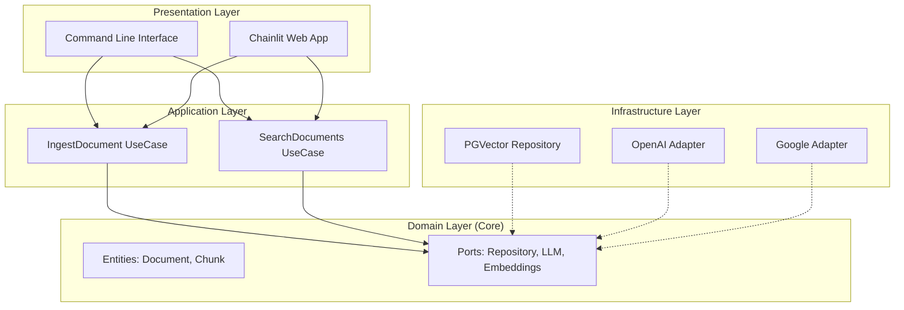

# 🤖 MBA Engenharia de Software com IA - Desafio Ingestão e Busca

> **Sistema de Ingestão e Busca Semântica (RAG)** desenvolvido com **Clean Architecture**, **LangChain** e **PostgreSQL (pgvector)**.


---

## 📖 Sobre o Projeto

Este projeto foi desenvolvido como parte do desafio do **MBA em Engenharia de Software com IA da Full Cycle**. O objetivo é criar um sistema robusto de **Retrieval-Augmented Generation (RAG)** capaz de:

1.  **Ingerir** documentos PDF, processando e armazenando seus embeddings de forma eficiente.
2.  **Buscar** informações semanticamente relevantes nos documentos ingeridos.
3.  **Responder** perguntas do usuário utilizando apenas o contexto dos documentos, evitando alucinações.

O sistema suporta múltiplos provedores de IA (**OpenAI** e **Google Gemini**) e utiliza **PostgreSQL com pgvector** para persistência vetorial de alta performance.

---

## ✨ Principais Funcionalidades

-   **🔍 Busca Semântica**: Utiliza o poder do `pgvector` para buscas por similaridade de cosseno.
-   **🏗️ Clean Architecture**: Código segue princípios de Clean e Hexagonal Architecture.
-   **🔌 Multi-Provider**: Alterne facilmente entre `OpenAI` e `Google Gemini`.
-   **🚀 Interface Web**: Interface moderna e interativa construída com **Chainlit**.
-   **⚡ Alta Performance**: Processamento assíncrono e banco de dados relacional robusto.

---

## 🏗️ Arquitetura do Sistema



-   **Domain**: Regras de negócio e interfaces (Ports). Não depende de frameworks externos.
-   **Application**: Casos de uso (`Ingestão`, `Busca`).
-   **Infrastructure**: Adaptadores (Banco de dados, APIs de LLM).
-   **Presentation**: Interfaces para o usuário final.

---

## 🚀 Como Executar

### ⚡ Início Rápido (Recomendado)

O projeto inclui um **script interativo** que automatiza toda a configuração:

```bash
python3 main.py
```

**Menu de Opções:**

| Opção | Descrição |
|-------|-----------|
| **1. Start System** | Cria `venv`, instala dependências, sobe Docker e inicia a aplicação |
| **2. Force Restart** | Mata processos travados e reinicia |
| **3. Quick Launch** | Pula verificações e inicia diretamente (para desenvolvimento) |
| **4. Stop All** | Encerra todos os processos |
| **5. Reset System** | Apaga Docker volumes, venv e configurações |
| **6. Exit** | Sai do script |

**Configuração Assistida:**
- Wizard pergunta qual provedor de IA usar (OpenAI ou Google Gemini)
- Solicita a API Key correspondente
- Gera automaticamente as demais configurações

---

### 📋 Instalação Manual

Se preferir configurar manualmente:

#### 1. Clone e Configure

```bash
git clone https://github.com/elimarcavalli/mba-ia-desafio-ingestao-busca.git
cd mba-ia-desafio-ingestao-busca
cp .env.example .env
# Edite o arquivo .env com suas credenciais
```

#### 2. Inicie a Infraestrutura

```bash
docker compose up -d
```

#### 3. Instale Dependências

```bash
python -m venv venv
source venv/bin/activate  # Linux/Mac
pip install -r requirements.txt
```

#### 4. Execute a Aplicação

**Interface Web (Chainlit):**
```bash
cd src/presentation/web
chainlit run chainlit_app.py --port 8000
```

**Interface CLI:**
```bash
python -m src.main
```

---

## 📈 Escalabilidade

### Banco de Dados Robusto (PostgreSQL)
- **Persistência ACID**: Dados seguros mesmo se o container cair
- **Escalabilidade**: Suporta milhões de vetores com indexação HNSW
- **Dados Relacionais**: Cruzamento de metadados com busca semântica

### Arquitetura Modular
- **Troca de Modelo**: Substituir GPT-4 por Claude ou Llama requer apenas novo Adapter
- **Troca de Vector Store**: Migrar para Qdrant ou Pinecone exige nova implementação de `RepositoryPort`

### Pronto para Produção
- Containerização Docker pronta para Kubernetes
- Serviços podem ser escalados independentemente

---

## 🧪 Testes

Execute os testes unitários e de integração:

```bash
pytest src/tests -v
```

---

## 📁 Estrutura do Projeto

```
src/
├── domain/              # Entidades e Ports (interfaces)
├── application/         # Casos de Uso
├── infrastructure/      # Adaptadores (DB, LLM, Auth)
├── presentation/        # CLI e Web (Chainlit)
├── config/              # Configurações
└── scripts/             # Scripts de manutenção
```

---

## 🛠️ Tecnologias

| Componente | Tecnologia |
|------------|------------|
| Linguagem | Python 3.12+ |
| Framework IA | LangChain |
| Vector Database | PostgreSQL + pgvector |
| Interface Web | Chainlit |
| Containerização | Docker / Docker Compose |
| Provedores LLM | OpenAI, Google Gemini |

---

## 📄 Licença

Este projeto está sob a licença MIT.

---

**Desenvolvido por [Elimar Cavalli](https://github.com/elimarcavalli)**

*Desafio do MBA em Engenharia de Software com IA - Full Cycle*