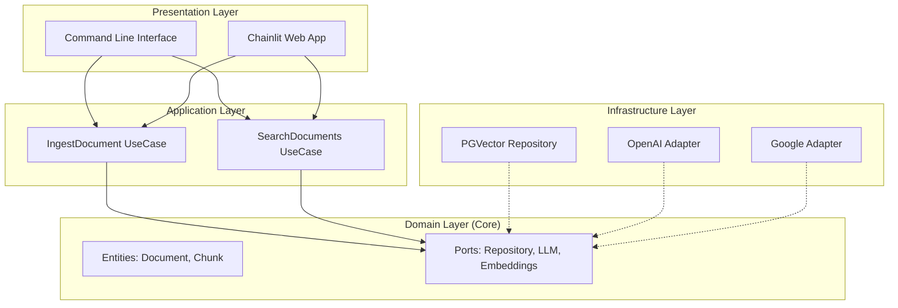

# 🤖 MBA Engenharia de Software com IA - Desafio Ingestão e Busca

> **Sistema de Ingestão e Busca Semântica (RAG)** desenvolvido com **Clean Architecture**, **LangChain** e **PostgreSQL (pgvector)**.


---

## 📖 Sobre o Projeto

Este projeto foi desenvolvido como parte do desafio do **MBA em Engenharia de Software com IA da Full Cycle**. O objetivo é criar um sistema robusto de **Retrieval-Augmented Generation (RAG)** capaz de:

1.  **Ingerir** documentos PDF, processando e armazenando seus embeddings de forma eficiente.
2.  **Buscar** informações semanticamente relevantes nos documentos ingeridos.
3.  **Responder** perguntas do usuário utilizando apenas o contexto dos documentos, evitando alucinações.

O sistema suporta múltiplos provedores de IA (**OpenAI** e **Google Gemini**) e utiliza **PostgreSQL com pgvector** para persistência vetorial de alta performance.

---

## ✨ Principais Funcionalidades

-   **🔍 Busca Híbrida e Semântica**: Utiliza o poder do `pgvector` para buscas por similaridade de cosseno de alta precisão.
-   **🏗️ Clean Architecture**: O código segue rigorosamente os princípios de Clean e Hexagonal Architecture, garantindo desacoplamento entre domínio, aplicação e infraestrutura.
-   **🔌 Multi-Provider**: Design agnóstico que permite alternar facilmente entre `OpenAI` e `Google Gemini` apenas mudando configurações.
-   **🚀 Interface Dupla**: Oferece uma CLI simples para testes rápidos e uma interface Web moderna e interativa construída com **Chainlit**.
-   **⚡ Alta Performance**: Processamento assíncrono e uso de banco de dados relacional robusto para escalar a base de conhecimentos.

---

## 🏗️ Arquitetura do Sistema

O projeto está organizado para facilitar a manutenção e escalabilidade:



-   **Domain**: Contém as regras de negócio e interfaces (Ports). Não depende de frameworks externos.
-   **Application**: Implementa os casos de uso (`Ingestão`, `Busca`).
-   **Infrastructure**: Implementa os adaptadores (Banco de dados, APIs de LLM).
-   **Presentation**: Interfaces para o usuário final.

---

## 🚀 Como Executar

### Pré-requisitos

-   **Docker & Docker Compose**
-   **Python 3.12+** (para execução local sem Docker)
-   Chaves de API da **OpenAI** ou **Google**

### 1. Configuração do Ambiente

Clone o repositório e configure as variáveis de ambiente:

```bash
git clone <url-do-repositorio>
cd mba-ia-desafio-ingestao-busca
cp .env.example .env
```

Edite o arquivo `.env` com suas credenciais.

### 2. Início Rápido (Recomendado)

Utilize o script interativo que configura tudo para você (venv, dependências e docker):

```bash
python start.py
```

### 3. Instalação Manual (Alternativa)

Caso prefira fazer passo-a-passo:

#### Iniciando a Infraestrutura
Suba o banco de dados PostgreSQL com a extensão pgvector já configurada:

```bash
docker compose up -d
```

#### Instalação de Dependências

```bash
python -m venv venv
source venv/bin/activate  # Linux/Mac
# ou .\venv\Scripts\activate  # Windows

pip install -r requirements.txt
```

#### Executando a Aplicação


### 4. Executando a Aplicação

#### 🖥️ Interface Web (Recomendado)

Utilize a interface visual interativa do Chainlit:

```bash
cd src/presentation/web
chainlit run chainlit_app.py -w
```
Acesse em: `http://localhost:8000`

#### 💻 Interface CLI

Para testes rápidos via terminal:

```bash
python -m src.main
```

---

## 📈 Escalabilidade e Visão de Futuro

Este projeto foi desenhado pensando em crescimento. Aqui estão os pontos chave que permitem ao sistema escalar:

### 1. Banco de Dados Robusto (PostgreSQL vs Toy DBs)
Diferente de soluções que usam ChromaDB ou FAISS em memória, optamos pelo **PostgreSQL**. Isso garante:
-   **Persistência ACID**: Seus dados não são perdidos se o container cair.
-   **Escalabilidade Horizontal**: O Postgres suporta milhões de vetores com a indexação HNSW do pgvector.
-   **Dados Relacionais**: Possibilidade de cruzar metadados relacionais (autores, datas) com busca semântica na mesma query.

### 2. Containerização e Microserviços
A aplicação está Dockerizada, pronta para ser orquestrada via **Kubernetes**.
-   O serviço de ingestão pode ser separado do serviço de busca em pods distintos para escalar conforme a demanda de leitura vs escrita.

### 3. Adapters Modulares
A arquitetura hexagonal permite trocar componentes sem refatorar o core:
-   **Mudança de Modelo**: Trocar GPT-4 por Claude ou Llama 3 é apenas uma questão de criar um novo Adapter em `src/infrastructure/adapters`.
-   **Mudança de Vector Store**: Migrar para Qdrant ou Pinecone exigiria apenas uma nova implementação de `RepositoryPort`.

### 4. Processamento Assíncrono
A interface Chainlit já opera de forma assíncrona. O próximo passo lógico para escala massiva seria introduzir filas (RabbitMQ/Kafka) na camada de Ingestão para processar milhares de PDFs em background sem travar a API.

---

## 🛠️ Desenvolvimento

Para rodar os testes unitários e de integração:

```bash
pytest src/tests -v
```

---
**Desenvolvido para o MBA Full Cycle - Engenharia de Software com IA**