# 🏗️ 1. System Architecture

**DocMind** was built following the principles of **Clean Architecture** (Hexagonal Architecture).

The goal is to isolate business rules from technical details such as databases, APIs, and frameworks.

---

## 🗺️ Overview

The system is organized in **concentric layers**.
Dependencies point only **inward**.

```mermaid
graph TD
    subgraph Presentation ["🔵 Presentation"]
        CLI[CLI]
        Web[Web Chainlit]
    end

    subgraph Infrastructure ["🟢 Infrastructure"]
        PGVector[PGVector Repository]
        OpenAI[OpenAI Adapter]
        Google[Google Adapter]
        Factory[ProviderFactory]
    end

    subgraph Application ["🟡 Application"]
        Ingest[IngestDocument]
        Search[SearchDocuments]
    end

    subgraph Domain ["🔴 Domain"]
        Entities[Entities]
        Ports[Ports]
    end

    Presentation --> Application
    Application --> Domain
    Infrastructure --> Domain
    Presentation -.-> Factory
    Factory -.-> Infrastructure
```

---

## 🔴 Domain (The Core)

**Location:** `src/domain/`

Pure business rules.
This layer **does not know** that a database or AI exists.

| Folder          | Contents                                      |
| --------------- | --------------------------------------------- |
| `entities/`     | `Document`, `DocumentChunk`, `SearchResult`   |
| `ports/`        | `RepositoryPort`, `LLMPort`, `EmbeddingsPort` |
| `exceptions.py` | Domain exceptions                             |

> **Rule:** No imports from LangChain, SQLAlchemy, or external libraries.

---

## 🟡 Application (Use Cases)

**Location:** `src/application/use_cases/`

Coordinates the flow between Ports.

| File                  | Responsibility                      |
| --------------------- | ----------------------------------- |
| `ingest_document.py`  | PDF → Chunks → Vectors → Database   |
| `search_documents.py` | Question → Context → LLM → Response |

---

## 🟢 Infrastructure (Implementations)

**Location:** `src/infrastructure/`

Implements the Ports with real technologies.

| Folder       | Contents                                                     |
| ------------ | ------------------------------------------------------------ |
| `adapters/`  | `PGVectorRepository`, `OpenAILLMAdapter`, `GoogleLLMAdapter` |
| `factories/` | `ProviderFactory` (dependency injection)                     |

> If you switch PostgreSQL for another database, you only need to change **this** layer.

---

## 🔵 Presentation (Interface)

**Location:** `src/presentation/`

User entry point.

| Folder | Technology           |
| ------ | -------------------- |
| `web/` | Chainlit             |
| `cli/` | Interactive terminal |

---

## 🔄 Flow: Asking a Question

1. User types in the Web
2. Web calls `SearchDocuments` (Application)
3. Application uses `RepositoryPort` to fetch context
4. Application uses `LLMPort` to generate response
5. Infrastructure executes the actual calls
6. Response returns to the user

---

## 📚 References

**Original Sources:**

- [Clean Architecture - Uncle Bob (2012)](https://blog.cleancoder.com/uncle-bob/2012/08/13/the-clean-architecture.html)
- [Hexagonal Architecture - Alistair Cockburn (2005)](https://alistair.cockburn.us/hexagonal-architecture/)

**Modern Practical Guides:**

- [Hexagonal Architecture Explained (HappyCoders)](https://www.happycoders.eu/software-craftsmanship/hexagonal-architecture/)
- [Hexagonal Architecture (Baeldung)](https://www.baeldung.com/hexagonal-architecture-ddd-spring)

**Library Documentation:**

- [LangChain Documentation](https://python.langchain.com/docs/)
- [Chainlit Documentation](https://docs.chainlit.io/)
