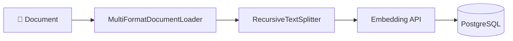
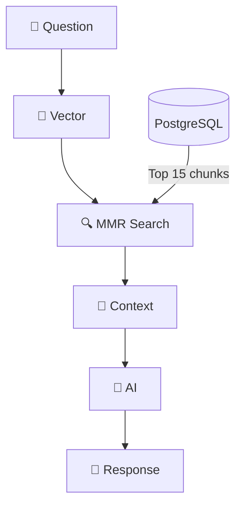

# 🧠 2. RAG Flow (Retrieval-Augmented Generation)

**RAG** is the technique that combines database search with AI text generation.

The system processes documents in two phases: **Ingestion** and **Search**.

---

## 🏗️ 1. Ingestion Pipeline

Before answering questions, the system needs to process the document.

```mermaid
graph LR
    Doc[📄 Document] --> Loader[MultiFormatDocumentLoader]
    Loader --> Splitter[RecursiveTextSplitter]
    Splitter --> Embedder[Embedding API]
    Embedder --> DB[(PostgreSQL)]
```

### Steps:

**1.1. Loading**

- Adapter: `MultiFormatDocumentLoader` (dispatches to the correct loader by extension)
- Supported formats: **PDF, TXT, CSV, HTML, JSON, Markdown (.md), DOCX**
- Internal loaders: `PyPDFLoader`, `TextLoader`, `CSVLoader`, `BSHTMLLoader`, `Docx2txtLoader` (LangChain) + custom JSON parser

**1.2. Splitting (Chunking)**

- Library: `RecursiveCharacterTextSplitter`
- Size: **1000 characters**
- Overlap: **150 characters**

> The overlap prevents cutting important sentences in half.

**1.3. Vectorization**

- Each chunk becomes a numerical vector
- Similar sentences generate nearby vectors

**1.4. Storage**

- Vectors saved in PostgreSQL with **pgvector** extension

---

## 🔎 2. Search Pipeline

When you ask a question:

```mermaid
graph TD
    User[👤 Question] --> QueryEmbed[🔢 Vector]
    QueryEmbed --> Search[🔍 MMR Search]
    DB[(PostgreSQL)] -->|Top 15 chunks| Search
    Search --> Context[📝 Context]
    Context --> LLM[🧠 AI]
    LLM --> Answer[💬 Response]
```

### Steps:

**2.1. Semantic Search with MMR**

- Your question is converted into a vector
- The repository uses **MMR (Maximal Marginal Relevance)**: it fetches `fetch_k = k × 3` candidates by cosine similarity and selects the final `k` by maximizing relevance **and** diversity — avoiding redundant chunks from the same part of the document.
- Returns 15 chunks (configurable via `RETRIEVER_K`)

**2.2. Context Assembly**

- Each chunk becomes `<document source="<file>" id=N>...</document>` so the LLM can cite the source

**2.3. Generation**

- AI receives: instruction + context + question
- AI responds based only on the context

---

## ⚙️ Settings

| Parameter       | Default | Description                                        |
| --------------- | ------- | -------------------------------------------------- |
| `CHUNK_SIZE`    | 1000    | Size of each chunk (characters)                    |
| `CHUNK_OVERLAP` | 150     | Overlap between chunks                             |
| `RETRIEVER_K`   | 15      | Number of chunks retrieved (MMR `fetch_k=45`)      |
| `LLM_TIMEOUT`   | 60      | Timeout in seconds for LLM calls                   |

Settings in: `src/config/settings.py` or `.env`

---

## 📚 References

- [RAG - Retrieval-Augmented Generation](https://docs.langchain.com/langsmith/evaluation-approaches#retrieval-augmented-generation-rag)
- [LangChain Text Splitters](https://python.langchain.com/docs/how_to/#text-splitters)
- [LangChain Document Loaders](https://python.langchain.com/docs/integrations/document_loaders/)
- [RecursiveCharacterTextSplitter](https://python.langchain.com/api_reference/text_splitters/character/langchain_text_splitters.character.RecursiveCharacterTextSplitter.html)
- [Maximal Marginal Relevance (MMR)](https://python.langchain.com/api_reference/postgres/vectorstores/langchain_postgres.vectorstores.PGVector.html#langchain_postgres.vectorstores.PGVector.max_marginal_relevance_search)
