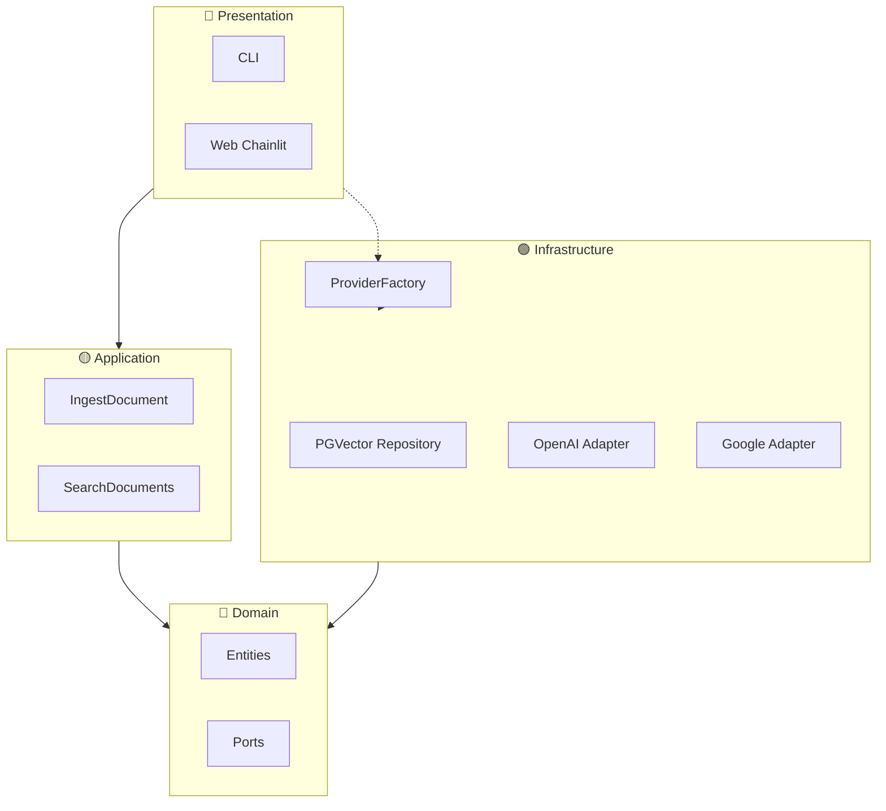

# 🏗️ 1. Arquitetura do Sistema

O **DocMind** foi construído seguindo os princípios da **Clean Architecture** (Arquitetura Hexagonal).

O objetivo é isolar as regras de negócio de detalhes técnicos como banco de dados, APIs e frameworks.

---

## 🗺️ Visão Geral

O sistema é organizado em **camadas concêntricas**.
As dependências apontam apenas **para dentro**.

---

## 🔴 Domain (O Núcleo)

**Localização:** `src/domain/`

Regras de negócio puras.
Esta camada **não sabe** que existe banco de dados ou IA.

| Pasta           | Conteúdo                                      |
| --------------- | --------------------------------------------- |
| `entities/`     | `Document`, `DocumentChunk`, `SearchResult`   |
| `ports/`        | `RepositoryPort`, `LLMPort`, `EmbeddingsPort` |
| `exceptions.py` | Exceções de domínio                           |

> **Regra:** Nenhum import de LangChain, SQLAlchemy ou bibliotecas externas.

---

## 🟡 Application (Casos de Uso)

**Localização:** `src/application/use_cases/`

Coordena o fluxo entre as Ports.

| Arquivo               | Responsabilidade                     |
| --------------------- | ------------------------------------ |
| `ingest_document.py`  | PDF → Chunks → Vetores → Banco       |
| `search_documents.py` | Pergunta → Contexto → LLM → Resposta |

---

## 🟢 Infrastructure (Implementações)

**Localização:** `src/infrastructure/`

Implementa as Ports com tecnologias reais.

| Pasta        | Conteúdo                                                     |
| ------------ | ------------------------------------------------------------ |
| `adapters/`  | `PGVectorRepository`, `OpenAILLMAdapter`, `GoogleLLMAdapter` |
| `factories/` | `ProviderFactory` (injeção de dependência)                   |

> Se trocar PostgreSQL por outro banco, altera-se **apenas** esta camada.

---

## 🔵 Presentation (Interface)

**Localização:** `src/presentation/`

Ponto de entrada do usuário.

| Pasta  | Tecnologia          |
| ------ | ------------------- |
| `web/` | Chainlit            |
| `cli/` | Terminal interativo |

---

## 🔄 Fluxo: Fazer uma Pergunta

1. Usuário digita na Web
2. Web chama `SearchDocuments` (Application)
3. Application usa `RepositoryPort` para buscar contexto
4. Application usa `LLMPort` para gerar resposta
5. Infrastructure executa as chamadas reais
6. Resposta retorna ao usuário

---

## 📚 Referências

**Fontes Originais:**

- [Clean Architecture - Uncle Bob (2012)](https://blog.cleancoder.com/uncle-bob/2012/08/13/the-clean-architecture.html)
- [Hexagonal Architecture - Alistair Cockburn (2005)](https://alistair.cockburn.us/hexagonal-architecture/)

**Guias Práticos Modernos:**

- [Hexagonal Architecture Explained (HappyCoders)](https://www.happycoders.eu/software-craftsmanship/hexagonal-architecture/)
- [Hexagonal Architecture (Baeldung)](https://www.baeldung.com/hexagonal-architecture-ddd-spring)

**Documentação das Bibliotecas:**

- [LangChain Documentation](https://python.langchain.com/docs/)
- [Chainlit Documentation](https://docs.chainlit.io/)
