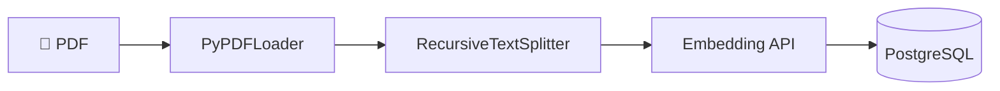
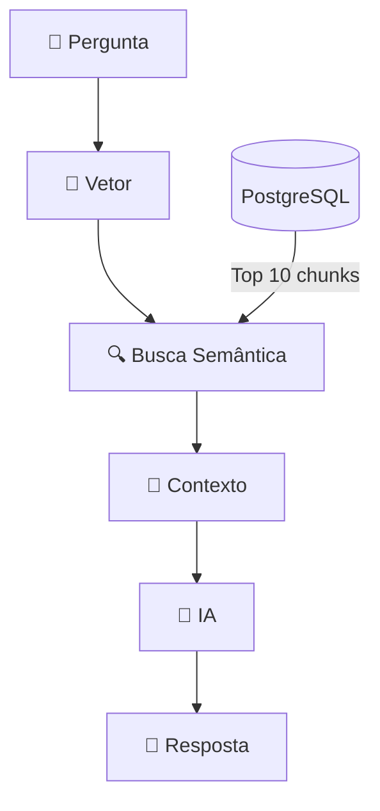

# 🧠 2. Fluxo RAG (Retrieval-Augmented Generation)

O **RAG** é a técnica que une busca em banco de dados com geração de texto por IA.

O sistema processa documentos em duas fases: **Ingestão** e **Busca**.

---

## 🏗️ 1. Pipeline de Ingestão

Antes de responder perguntas, o sistema precisa processar o PDF.

### Etapas:

**1.1. Carregamento**

- Biblioteca: `PyPDFLoader` (LangChain)
- Converte PDF em texto puro

**1.2. Divisão (Chunking)**

- Biblioteca: `RecursiveCharacterTextSplitter`
- Tamanho: **1000 caracteres**
- Sobreposição: **150 caracteres**

> O overlap evita cortar frases importantes no meio.

**1.3. Vetorização**

- Cada chunk vira um vetor numérico
- Frases similares geram vetores próximos

**1.4. Armazenamento**

- Vetores salvos no PostgreSQL com extensão **pgvector**

---

## 🔎 2. Pipeline de Busca

Quando você faz uma pergunta:

### Etapas:

**2.1. Busca Semântica**

- Sua pergunta é convertida em vetor
- PostgreSQL calcula distância de cosseno
- Retorna os 10 chunks mais similares

**2.2. Montagem de Contexto**

- Os 10 chunks são concatenados em XML

**2.3. Geração**

- IA recebe: instrução + contexto + pergunta
- IA responde baseada apenas no contexto

---

## ⚙️ Configurações

| Parâmetro       | Padrão | Descrição                          |
| --------------- | ------ | ---------------------------------- |
| `CHUNK_SIZE`    | 1000   | Tamanho de cada chunk (caracteres) |
| `CHUNK_OVERLAP` | 150    | Sobreposição entre chunks          |
| `RETRIEVER_K`   | 10     | Quantidade de chunks recuperados   |

Configurações em: `src/config/settings.py` ou `.env`

---

## 📚 Referências

- [RAG - Retrieval-Augmented Generation](https://docs.langchain.com/langsmith/evaluation-approaches#retrieval-augmented-generation-rag)
- [LangChain Text Splitters](https://python.langchain.com/docs/how_to/#text-splitters)
- [PyPDFLoader](https://python.langchain.com/docs/integrations/document_loaders/pypdfloader/)
- [RecursiveCharacterTextSplitter](https://python.langchain.com/api_reference/text_splitters/character/langchain_text_splitters.character.RecursiveCharacterTextSplitter.html)
