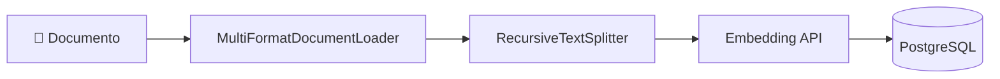
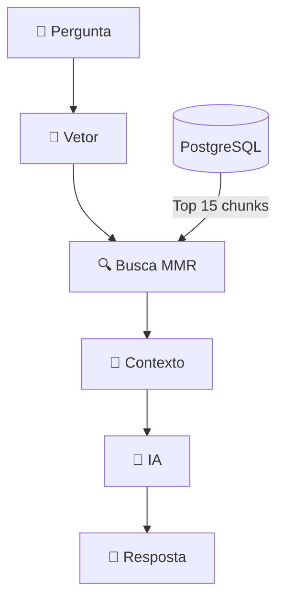

# 🧠 2. Fluxo RAG (Retrieval-Augmented Generation)

O **RAG** é a técnica que une busca em banco de dados com geração de texto por IA.

O sistema processa documentos em duas fases: **Ingestão** e **Busca**.

---

## 🏗️ 1. Pipeline de Ingestão

Antes de responder perguntas, o sistema precisa processar o documento.

```mermaid
graph LR
    Doc[📄 Documento] --> Loader[MultiFormatDocumentLoader]
    Loader --> Splitter[RecursiveTextSplitter]
    Splitter --> Embedder[Embedding API]
    Embedder --> DB[(PostgreSQL)]
```

### Etapas:

**1.1. Carregamento**

- Adapter: `MultiFormatDocumentLoader` (despacha para o loader correto via extensão)
- Formatos suportados: **PDF, TXT, CSV, HTML, JSON, Markdown (.md), DOCX**
- Loaders internos: `PyPDFLoader`, `TextLoader`, `CSVLoader`, `BSHTMLLoader`, `Docx2txtLoader` (LangChain) + parser JSON próprio

**1.2. Divisão (Chunking)**

- Biblioteca: `RecursiveCharacterTextSplitter`
- Tamanho: **1000 caracteres**
- Sobreposição: **150 caracteres**

> O overlap evita cortar frases importantes no meio.

**1.3. Vetorização**

- Cada chunk vira um vetor numérico
- Frases similares geram vetores próximos

**1.4. Armazenamento**

- Vetores salvos no PostgreSQL com extensão **pgvector**

---

## 🔎 2. Pipeline de Busca

Quando você faz uma pergunta:

```mermaid
graph TD
    User[👤 Pergunta] --> QueryEmbed[🔢 Vetor]
    QueryEmbed --> Search[🔍 Busca MMR]
    DB[(PostgreSQL)] -->|Top 15 chunks| Search
    Search --> Context[📝 Contexto]
    Context --> LLM[🧠 IA]
    LLM --> Answer[💬 Resposta]
```

### Etapas:

**2.1. Busca Semântica com MMR**

- Sua pergunta é convertida em vetor
- O repositório usa **MMR (Maximal Marginal Relevance)**: busca `fetch_k = k × 3` candidatos por similaridade de cosseno e seleciona `k` finais maximizando relevância **e** diversidade — evita chunks redundantes do mesmo trecho do documento.
- Retorna 15 chunks (configurável via `RETRIEVER_K`)

**2.2. Montagem de Contexto**

- Cada chunk vira `<document source="<arquivo>" id=N>...</document>` para que o LLM cite a origem

**2.3. Geração**

- IA recebe: instrução + contexto + pergunta
- IA responde baseada apenas no contexto

---

## ⚙️ Configurações

| Parâmetro       | Padrão | Descrição                                          |
| --------------- | ------ | -------------------------------------------------- |
| `CHUNK_SIZE`    | 1000   | Tamanho de cada chunk (caracteres)                 |
| `CHUNK_OVERLAP` | 150    | Sobreposição entre chunks                          |
| `RETRIEVER_K`   | 15     | Quantidade de chunks recuperados (MMR `fetch_k=45`) |
| `LLM_TIMEOUT`   | 60     | Timeout em segundos para chamadas LLM              |

Configurações em: `src/config/settings.py` ou `.env`

---

## 📚 Referências

- [RAG - Retrieval-Augmented Generation](https://docs.langchain.com/langsmith/evaluation-approaches#retrieval-augmented-generation-rag)
- [LangChain Text Splitters](https://python.langchain.com/docs/how_to/#text-splitters)
- [LangChain Document Loaders](https://python.langchain.com/docs/integrations/document_loaders/)
- [RecursiveCharacterTextSplitter](https://python.langchain.com/api_reference/text_splitters/character/langchain_text_splitters.character.RecursiveCharacterTextSplitter.html)
- [Maximal Marginal Relevance (MMR)](https://python.langchain.com/api_reference/postgres/vectorstores/langchain_postgres.vectorstores.PGVector.html#langchain_postgres.vectorstores.PGVector.max_marginal_relevance_search)
